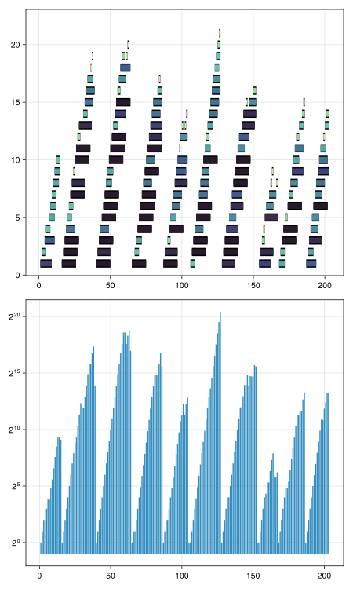

# Day 04: Scratchcards
Now I'm so happy with the parser combinator! We need just one more combinator, `some_p` for one or more matches. Also, let's add the `token` abbreviation.

``` {.julia #parsers}
some_p(p::Parser) = sequence(p, many_p(p)) >>
                    starmap((first, rest) -> pushfirst!(rest, first))

token = token_p ∘ match_p
```

``` {.julia #day04}
using ..Parsing: token, sequence, skip, fmap, starmap, some_p

struct Card
    number::Int
    winning::Set{Int}
    trial::Vector{Int}
end

unsigned = token(r"\d+") >> fmap(x -> parse(Int, x.match))

card_p = sequence(
    token("Card") >>> unsigned >> skip(token(":")),
    some_p(unsigned) >> skip(token("|")) >> fmap(Set),
    some_p(unsigned)) >> starmap(Card)
```

For part 1, we need to compute the score

``` {.julia #day04}
wins(c::Card) = sum(c.trial .∈ (c.winning,))
score(c::Card) = let x = wins(c) 
    x > 0 ? 2^(x - 1) : 0
end
```

For part 2, we get our first dynamic programming exercise. I made the mistake of coping `score(c)` amount of cards, getting me into ridiculous numbers.

``` {.julia #day04}
function play(cards::Vector{Card})
    copies = Vector{Union{Int,Nothing}}(nothing, length(cards))
    function f(n::Int)
        if n > length(copies)
            return 0
        end
        if isnothing(copies[n])
            s = wins(cards[n])
            copies[n] = sum(f.(n+1:n+s); init=1)
        end
        return copies[n]
    end
end
```

Maybe this was needlesly complicated, this is much simpler:

``` {.julia #day04}
function play2(cards::Vector{Card})
    copies = ones(Int, length(cards))
    for (i, c) in enumerate(cards)
        copies[i+1:i+wins(c)] .+= copies[i]
    end
    copies
end
```

## Main

``` {.julia file=src/Day04.jl}
module Day04

<<day04>>

function main(io::IO)
    input = readlines(io) .|> (first ∘ card_p)
    println("Part 1: ", input .|> score |> sum)
    println("Part 2: ", input |> play2 |> sum)
end

end
```

``` title="output day 4"

```

## Plot

``` {.julia .task}
#| creates: docs/fig/day04-ncards.png
#| requires: src/Day04.jl input/day04.txt
#| collect: figures
using CairoMakie
using AOC2023.Day04: card_p, play2, wins

CairoMakie.activate!()
cards = open(readlines, "input/day04.txt", "r") .|> (first ∘ card_p)

fig = Figure(size=(600, 1000))
ax = Axis(fig[2,1], yscale=log2)
barplot!(ax, 1:length(cards), play2(cards))

function stack(ws)
	height = zeros(Int, length(ws))
	segments = NTuple{2,Int}[]
	for (i, w) in enumerate(ws)
		h = maximum(height[i:i+w]) + 1
		height[i:i+w] .= h
		append!(segments, ((i, h), (i+w, h)))
	end
	segments
end

ax = Axis(fig[1, 1])
ws = wins.(cards)
linesegments!(ax, stack(ws); color=:black, linewidth=14)
linesegments!(ax, stack(ws); color=ws, colormap=:deep, linewidth=10)

save("docs/fig/day04-ncards.svg", fig) 
```



## Tests

``` {.julia #test}
@testset "day 4" begin
  using AOC2023.Day04: card_p, score, play, play2
  input = [
    "Card 1: 41 48 83 86 17 | 83 86  6 31 17  9 48 53",
    "Card 2: 13 32 20 16 61 | 61 30 68 82 17 32 24 19",
    "Card 3:  1 21 53 59 44 | 69 82 63 72 16 21 14  1",
    "Card 4: 41 92 73 84 69 | 59 84 76 51 58  5 54 83",
    "Card 5: 87 83 26 28 32 | 88 30 70 12 93 22 82 36",
    "Card 6: 31 18 13 56 72 | 74 77 10 23 35 67 36 11"
  ]
  cards = input .|> (first ∘ card_p)
  @test cards .|> score == [8, 2, 2, 1, 0, 0]
  @test 1:6 .|> play(cards) |> sum == 30
  @test cards |> play2 |> sum == 30
end
```
