# Day 05: If You Give A Seed A Fertilizer
This is a tricky exercise. Reading the input into the following structs.

``` {.julia #day05}
struct MapItem
  range::UnitRange{Int}
  offset::Int
end

struct SeedMap
  from::String
  to::String
  items::Vector{MapItem}
end

struct Almanak
  seeds::Vector{Int}
  maps::Vector{SeedMap}
end
```

??? "parsing"

    ``` {.julia #day05}
    function read_input(io::IO)
      token(expr) = token_p(match_p(expr), match_p(r" *"))
      newline = match_p(r"\n")
      integer = token(r"\d+") >> fmap(x -> parse(Int, x.match))

      map_item =
        sequence(integer, integer, integer) >>
        starmap((d, s, l) -> MapItem(s:s+l-1, d - s))
      seed_map =
        sequence(
          match_p(r"(?<from>[a-z]+)-to-(?<to>[a-z]+) map:") >> skip(newline),
          sep_by_p(map_item, newline)) >>
        starmap((m, x) -> SeedMap(m[:from], m[:to], x))
      almanak =
        sequence(
          token("seeds:") >>> some_p(integer) >> skip(some_p(newline)),
          some_p(seed_map >> skip(some_p(newline)))) >> starmap(Almanak)

      read(io, String) |> almanak |> first
    end
    ```

I wanted to use `searchsortedlast` to do this, but I couldn't get that function to do what I wanted (taking a lot of time in the process). I ended up implementing my own binary search.

``` {.julia #day05}
function search_sorted_ranges(vec::AbstractVector{UnitRange{Int}}, x::Int)
  a = 1
  b = length(vec)

  if x < vec[a].start
    return 1
  end
  if x > vec[b].stop
    return :over
  end

  while (b - a) > 1
    mid = (a + b) ÷ 2
    if x < vec[mid].start
      b = mid
      continue
    end
    if x > vec[mid].stop
      a = mid
      continue
    end
    return mid
  end

  if x > vec[a].stop
    return b
  else
    return a
  end
end
```

For part 1, that basically solves it.

``` {.julia #day05}
function find_map_item(vec::AbstractVector{MapItem}, l::Int)
  x = search_sorted_ranges(map(m -> m.range, vec), l)
  x isa Symbol ? nothing : (l in vec[x].range ? vec[x] : nothing)
end

function (m::SeedMap)(l::Int)
  f = find_map_item(m.items, l)
  isnothing(f) ? l : (l + f.offset)
end
```

For part 2, we need to scan all ranges to map them to next ranges etc. In the process we need to account for gaps, and take care of a lot of edge cases.

``` {.julia #day05}
function (m::SeedMap)(r::UnitRange{Int})
  if (r.stop < m.items[1].range.start) |
     (r.start > m.items[end].range.stop)
    return [r]
  end

  result = []
  start = r.start
  a = search_sorted_ranges(map(m -> m.range, m.items), start)

  for f in m.items[a:end]
    if start < f.range.start
      if r.stop < f.range.start
        push!(result, start:r.stop)
        return result
      end
      push!(result, start:f.range.start-1)
      start = f.range.start
    end
    substop = min(f.range.stop, r.stop)
    push!(result, start+f.offset:substop+f.offset)
    start = substop + 1
    if start > r.stop
      break
    end
  end
  if start < r.stop
    push!(result, start:r.stop)
  end
  result
end
```

## Main

``` {.julia file=src/Day05.jl}
module Day05

using ..Parsing: token_p, match_p, sep_by_p, fmap, some_p, sequence, starmap, skip
using .Iterators: flatmap

<<day05>>

function (maps::Vector{SeedMap})(i::Int)
  foldl((x, f) -> f(x), maps; init=i)
end

function (maps::Vector{SeedMap})(r::UnitRange{Int})
  foldl((x, f) -> collect(flatmap(f, x)), maps; init=[r])
end

# only tokenize on horizontal space
function main(io::IO)
  input = read_input(io)
  foreach(x -> sort!(x.items; by=y -> y.range), input.maps)
  println("Part 1: ", input.seeds .|> (input.maps,) |> minimum)
  ranges = map(x -> x[1]:x[1]+x[2]-1, eachcol(reshape(input.seeds, 2, :)))
  println("Part 2: ", ranges .|> (minimum ∘ input.maps) |> minimum |> minimum)
  input
end

end
```

``` title="output day 5"

```

## Visualization
I want to visualize the pathways of the stack of mappings. This may be easiest in my custom [Scheme to XML engine](svg-gen.md) to generate a nice SVG with splines etc.

``` {.bash .task}
#| collect: figures
#| stdout: docs/fig/day05-flow.svg
#| stdin: src/viz-day05.scm
#| requires: xml-gen.scm src/day05-data.scm
guile xml-gen.scm
```



??? "Write data to S-expr"

    ``` {.julia .task}
    #| requires: src/Day05.jl input/day05.txt
    #| creates: src/day05-data.scm
    using AOC2023.Day05: read_input
    using .Iterators: flatmap

    almanak = open(read_input, "input/day05.txt", "r")
    foreach(x -> sort!(x.items; by=y -> y.range), almanak.maps)

    open("src/day05-data.scm", "w") do io
      println(io, "(make-almanak")
      println(io, "  `(")
      ranges = map(x -> x[1]:x[1]+x[2]-1, eachcol(reshape(almanak.seeds, 2, :)))
      for r in ranges
        println(io, "     ((,(make-range $(r.start) $(r.stop + 1)))")
        s = [r]
        for m in almanak.maps
            s = collect(flatmap(m, s))
            print(io, "      (")
            join(io, (",(make-range $(r.start) $(r.stop + 1))" for r in s), " ")
            println(io, ")")
        end
        println(io, "     )")
      end
      println(io, "   )")
      println(io, "  `(")
      for m in almanak.maps
        println(io, "     ,(make-mapping \"$(m.from)\" \"$(m.to)\" `(")
        for i in m.items
          println(io, "       (,(make-range $(i.range.start) $(i.range.stop+1)) . $(i.offset))")
        end
        println(io, "     ))")
      end
      println(io, "   )")
      println(io, ")")
    end
    ```

??? "SVG Generator"

    ``` {.scheme file=src/viz-day05.scm}
    (import (rnrs (6))
            (srfi srfi-13)   ; string library
            (ice-9 format))

    (define-syntax include
      (lambda (x)
        (define read-file
          (lambda (fn k)
            (let ([p (open-input-file fn)])
              (let f ([x (read p)])
                (if (eof-object? x)
                    (begin (close-port p) '())
                    (cons (datum->syntax k x) (f (read p))))))))
        (syntax-case x ()
          [(k filename)
           (let ([fn (syntax->datum #'filename)])
             (with-syntax ([(expr ...) (read-file fn #'k)])
               #'(begin expr ...)))])))

    <<strip-css-comments>>

    (define-record-type range
      (fields start stop))

    (define-record-type mapping
      (fields from to segments))

    (define-record-type almanak
      (fields seeds maps))

    (define almanak (include "src/day05-data.scm"))

    (define (plot-segment r o)
      (let* ((a (* 1e-9 (range-start r)))
             (b (* 1e-9 (range-stop r)))
             (c (* 1e-9 (+ (range-stop r) o)))
             (d (* 1e-9 (+ (range-start r) o))))
      `((g class: "segment")
          (path d: ,(format #f "M ~a ~a L ~a ~a C ~a ~a, ~a ~a, ~a ~a L ~a ~a C ~a ~a, ~a ~a, ~a ~a"
                            0.0 a 0.0 b 0.5 b 0.5 c 1.0 c 1.0 d 0.5 d 0.5 a 0.0 a)
                class: "fill"
          /)
          (path d: ,(format #f "M ~a ~a C ~a ~a ~a ~a ~a ~a"
                            0.0 b 0.5 b 0.5 c 1.0 c)
                class: "line"
          /)
          (path d: ,(format #f "M ~a ~a C ~a ~a ~a ~a ~a ~a"
                            1.0 d 0.5 d 0.5 a 0.0 a)
                class: "line"
          /)
        (/g))))

    (define (flatmap f . args)
      (apply append (apply map f args)))

    (define (range n)
      (do ((x 0 (+ x 1))
           (r '() (cons x r)))
          ((= x n) (reverse r))))

    (define (plot-mapping m n)
      `((g class: "map" transform: ,(format #f "translate(~a 0)" n))
        ,@(flatmap (lambda (s) (plot-segment (car s) (cdr s))) (mapping-segments m))
        (/g)))

    (define style-sheet "
      svg {
      }
      .segment .line {
        fill: none;
        stroke: #888;
        stroke-width: 0.005;
        opacity: 0.5;
      }
      .segment .fill {
        fill: hsl(0deg, 60%, 50%);
        opacity: 0.15;
      }
      .ruler {
        stroke: #888;
        stroke-width: 0.01;
      }
      .no0 { --hue: 0deg; }
      .no1 { --hue: 30deg; }
      .no2 { --hue: 60deg; }
      .no3 { --hue: 90deg; }
      .no4 { --hue: 120deg; }
      .no5 { --hue: 150deg; }
      .no6 { --hue: 180deg; }
      .no7 { --hue: 210deg; }
      .no8 { --hue: 240deg; }
      .no9 { --hue: 270deg; }
      .seed {
        stroke: hsl(var(--hue), 60%, 60%);
        stroke-width: 0.1;
        filter: hue-rotate(-20deg) drop-shadow(0px 0px 0.02px #888888);
      }
      text {
        font-size: 30px;
        fill: #888;
        font-family: 'Monofur Nerd Font';
      }
      ")

    (define names
      (let ((m (almanak-maps almanak)))
        (cons (mapping-from (car m))
              (map mapping-to m))))

    (define (plot-seed s no)
      `((g class: ,(format #f "ranges no~a" no))
        ,@(flatmap (lambda (rs n)
                     (map (lambda (r)
                            `(line class: "seed" x1: ,n
                                   y1: ,(* 1e-9 (range-start r))
                                   y2: ,(* 1e-9 (range-stop r)) x2: ,n /)) rs))
               s (range 8))
        (/g)))

    `((?xml version: "1.0" standalone: "no" ?)
      (svg viewBox: "0 0 1580 1050"
           xmlns: "http://www.w3.org/2000/svg"
           xmlns:xlink: "http://www.w3.org/1999/xlink")
        (style) ,style-sheet (/style)
        (g transform: "scale(200 200) translate(0.3 0.5)")
        ,@(flatmap plot-mapping (almanak-maps almanak)
                   (range (length (almanak-maps almanak))))
        ,@(map (lambda (n) `(line class: "ruler" x1: ,n y1: -0.1  y2: 4.4 x2: ,n /)) (range 8))
        ,@(flatmap plot-seed (almanak-seeds almanak) (range (length (almanak-seeds almanak))))
        (/g)
        (g transform: "translate(60 100)")
        ,@(flatmap (lambda (n t) `((text text-anchor: "middle" x: ,(* 200 n) y: -40) ,t (/text))) (range 8) names)
        (/g)
      (/svg))
    ```

## Tests

??? "testing"

    ``` {.julia #test}
    @testset "day 5" begin
      using AOC2023.Day05: read_input
      data = "seeds: 79 14 55 13\n\
              \n\
              seed-to-soil map:\n\
              50 98 2\n\
              52 50 48\n\
              \n\
              soil-to-fertilizer map:\n\
              0 15 37\n\
              37 52 2\n\
              39 0 15\n\
              \n\
              fertilizer-to-water map:\n\
              49 53 8\n\
              0 11 42\n\
              42 0 7\n\
              57 7 4\n\
              \n\
              water-to-light map:\n\
              88 18 7\n\
              18 25 70\n\
              \n\
              light-to-temperature map:\n\
              45 77 23\n\
              81 45 19\n\
              68 64 13\n\
              \n\
              temperature-to-humidity map:\n\
              0 69 1\n\
              1 0 69\n\
              \n\
              humidity-to-location map:\n\
              60 56 37\n\
              56 93 4\n"
      input = read_input(IOBuffer(data))
      foreach(x -> sort!(x.items; by=y -> y.range), input.maps)
      @test input.seeds .|> (input.maps,) |> minimum == 35
      ranges = map(x -> x[1]:x[1]+x[2]-1, eachcol(reshape(input.seeds, 2, :)))
      @test ranges .|> (minimum ∘ input.maps) |> minimum |> minimum == 46
    end
    ```
