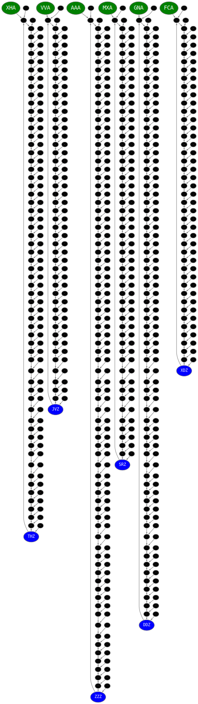

# Day 08: Haunted Wasteland
I could only solve this due to the benevolent input. Benevolent in part 1, because no path from a single node passes through `ZZZ` midst instructions. That means we can search a path in a reduced map, and multiply that with the length of instructions.

In part 2 we're helped even more: the distance from `/..A/` to `/..Z/` is a prime number and equal to the corresponding distance from `/..Z/` back to `/..Z/`. So we find the answer by multiplying those distances.

## Parsing

``` {.julia #day08}
using ..Parsing: token, sequence, fmap, starmap, some_p, skip

struct Node
  left::String
  right::String
end

struct Input
  instructions::String
  network::Dict{String,Node}
end

tokenm(re) = token(re) >> fmap(m -> m.match)
identifier = tokenm(r"[A-Z]{3}")

input_p = sequence(
  tokenm(r"[LR]+"),
  some_p(sequence(
    identifier,
    token("=") >>> sequence(
      token("(") >>> identifier,
      token(",") >>> identifier >> skip(token(")"))) >> starmap(Node)
  ) >> starmap(Pair)) >> fmap(Dict)
) >> starmap(Input)
```

## Reducing

``` {.julia #day08}
map_node(network::Dict{String,Node}, id::String, instructions::String) =
  foldl((id, lr) -> lr == 'L' ? network[id].left : network[id].right,
    instructions; init=id)

function dist(step_map, from::String, to::Union{String,Regex})
  x = 1
  a = step_map[from]
  while !occursin(to, a)
    a = step_map[a]
    x += 1
  end
  x
end
```

## Main

``` {.julia file=src/Day08.jl}
module Day08

<<day08>>

function main(io::IO)
  input = read(io, String) |> input_p |> first
  nodes = collect(keys(input.network))
  m = length(input.instructions)

  step_map = Dict(
    id => map_node(input.network, id, input.instructions)
    for id in nodes)
  println("Part 1: ", dist(step_map, "AAA", "ZZZ") * m)

  starts = nodes[occursin.(r"..A", nodes)]
  step_map = Dict(
    id => map_node(input.network, id, input.instructions)
    for id in nodes)
  println("Part 2: ", prod(dist(step_map, k, r"..Z") for k in starts; init=m))
end

end
```

``` title="output day 8"

```

## Visualisation



``` {.julia .task file=src/viz-day08-gen.jl}
#| creates: docs/fig/viz-day08.svg
#| requires: src/Day08.jl input/day08.txt
#| description: Create GraphViz plot
#| collect: figures

using AOC2023.Day08: input_p, map_node
using GraphvizDotLang: digraph, edge, save, node, attr

input = open("input/day08.txt", "r") do io
  read(io, String) |> input_p |> first
end
nodes = collect(keys(input.network))
m = length(input.instructions)

starts = nodes[occursin.(r"..A", nodes)]
step_map = Dict(
  id => map_node(input.network, id, input.instructions)
  for id in nodes)

# gt = digraph()
# for n in nodes
#   gt |> edge(n, input.network[n].left) |>
#        edge(n, input.network[n].right)
# end
# save(gt, "docs/fig/day08-tree.svg")

g = digraph(;bgcolor="transparent", nodesep="0.1", ranksep="0.05",
            rankdir="TD") |>
    attr(:node; style="filled", fillcolor="black", fontcolor="white", color="gray", fontname="monospace", fontsize="1", margin="0.05", width="0.05", height="0.05") |>
    attr(:edge; color="gray", arrowsize="0.3")
for s in starts
  g |> node(s; fillcolor="green", fontsize="14")
end
for e in nodes[occursin.(r"..Z", nodes)]
  g |> node(e; fillcolor="blue", fontsize="10")
end
for id in nodes
  g |> edge(id, map_node(input.network, id, input.instructions))
end
save(g, "docs/fig/viz-day08.svg")
```

