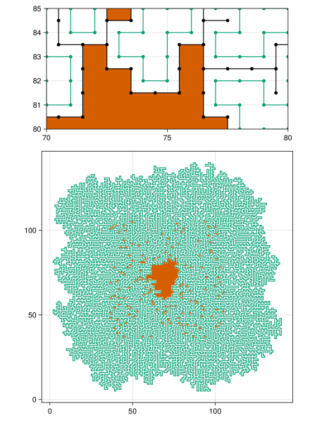

# Day 10: Pipe Maze

For part 2, we have Green's theorem:

$$\oint_{\partial D} (Pdx + Qdy) = \int \int_D \left(\frac{\partial Q}{\partial x}
- \frac{\partial P}{\partial y}\right) dx dy.$$

Setting $Q = x$ and $P = 0$, we get

$$\oint_{\partial D} xdy = \int \int_D dx dy.$$

Kind of obvious really, we didn't really need Green's for that. Every time we go south, we subtract the `-` shaded region, when we go back up north we add the `+` shaded region.

```
---------|..............................^......
+++++++++V++++++++++++++++++++++++++++++|......
```

Do this for the entire length of the path, and the surface area remains.

Note that, due to weird computer coordinates, positive orientation becomes a right-handed loop (clock-wise). Also we have to be **very careful** to take all details into account.

One big problem is that we have this weird contracted path on pixels. We may keep this contraction always on our right flank as we walk the path. We may keep track of the surface area on a dual grid, offset exactly half a pixel in each direction. That means that a turn right doesn't change the position of the area tracer, but a turn left changes it in two directions.

``` {.julia #test}
@testset "day 10" begin
  using AOC2023.Day10: start_pipe, trace_loop

  data = [
   ".....", 
   ".S-7.",
   ".|.|.",
   ".L-J.",
   "....." 
  ]

  pipe_map = data .|> collect |> x -> permutedims(reduce(hcat, x), (2, 1))
  start_pos = findfirst(pipe_map .== 'S')
  pipe_map[start_pos] = start_pipe(pipe_map, start_pos)
  pipe_map, start_pos
  _, dist, area = trace_loop(pipe_map, start_pos)
  @test dist == 8
  @test area == 1
end
```

``` {.julia file=src/Day10.jl}
module Day10

@enum Direction EAST = 1 NORTH = 2 WEST = 3 SOUTH = 4
@enum Turn LEFT RIGHT STRAIGHT

Base.:-(d::Direction) = Direction(mod1((Int(d) + 2), 4))
left(d::Direction) = Direction(mod1((Int(d) + 1), 4))
right(d::Direction) = Direction(mod1((Int(d) - 1), 4))
turn(d::Direction, t::Turn) = begin
  if t == LEFT
    left(d)
  elseif t == RIGHT
    right(d)
  else
    d
  end
end

legenda = Dict{Char,Union{Nothing,Pair{Direction,Direction}}}(
  '-' => (EAST => WEST),
  '|' => (NORTH => SOUTH),
  'L' => (EAST => NORTH),
  'J' => (NORTH => WEST),
  '7' => (WEST => SOUTH),
  'F' => (EAST => SOUTH),
  '.' => nothing
)
flip(p::Pair) = p.second => p.first
inv_legenda = Dict(flip(p) for p in legenda if !isnothing(p.second))
other(p::Pair{T,T}, x::T) where {T} = x == p.first ? p.second : p.first

turn_dir = Dict(
  ('L', WEST) => RIGHT,
  ('L', SOUTH) => LEFT,
  ('F', NORTH) => RIGHT,
  ('F', WEST) => LEFT,
  ('7', EAST) => RIGHT,
  ('7', NORTH) => LEFT,
  ('J', SOUTH) => RIGHT,
  ('J', EAST) => LEFT
)

star_shape = [CartesianIndex(0, 1), CartesianIndex(-1, 0), CartesianIndex(0, -1), CartesianIndex(1, 0)]
star(x::CartesianIndex) = x .+ star_shape
star(x::CartesianIndex, d::Direction) = x + star_shape[Int(d)]

function start_pipe(m::Matrix{Char}, i::CartesianIndex)
  triage(d) =
    let x = legenda[m[star(i, d)]]
      !isnothing(x) && -d in x
    end
  dirs = filter(triage, instances(Direction))
  @assert length(dirs) == 2
  inv_legenda[dirs[1]=>dirs[2]]
end

function read_input(io::IO)
  pipe_map = readlines(io) .|> collect |> x -> permutedims(reduce(hcat, x), (2, 1))
  start_pos = findfirst(pipe_map .== 'S')
  pipe_map[start_pos] = start_pipe(pipe_map, start_pos)
  pipe_map, start_pos
end

function trace_loop(m::Matrix{Char}, i::CartesianIndex)
  area = [0, 0]
  trace = Matrix{Union{Missing,Int}}(missing, size(m))
  dist = 0
  traveling = -legenda[m[i]].first

  while ismissing(trace[i])
    trace[i] = dist
    margin = traveling == NORTH || traveling == EAST
    r, l = right(traveling), left(traveling)
    dir = get(turn_dir, (m[i], traveling), STRAIGHT)
    if dir == STRAIGHT || dir == LEFT
      area .+= Tuple(margin ? star(i, r) : i) .* Tuple(star_shape[Int(-r)])
    end
    traveling = turn(traveling, dir)
    margin = traveling == NORTH || traveling == EAST
    r, l = right(traveling), left(traveling)
    if dir == LEFT
      area .+= Tuple(margin ? star(i, r) : i) .* Tuple(star_shape[Int(-r)])
    end
    i = star(i, traveling)
    dist += 1
  end

  a = area[1] < 0 ? -area[1] - dist : area[1]
  trace, dist, a
end

<<day10-plot>>

function main(io::IO)
  pipe_map, start_pos = read_input(io)
  _, dist, area = trace_loop(pipe_map, start_pos)
  println("Part 1: ", dist ÷ 2)
  println("Part 2: ", area)
end

end
```

``` title="output day 10"

```

## Alternative
There is a nice formula for the area of a polygon.

```julia
len = size(path)[2] ÷ 2
area = abs(sum(path[2,2:end] .* path[1,1:end-1]) - 
           sum(path[1,2:end] .* path[2,1:end-1])) ÷ 2 - len + 1
```

## Plot



??? "trace loop for plotting"

    ``` {.julia #day10-plot}
    function plot_loop(m::Matrix{Char}, i::CartesianIndex)
      path = [[i[1], i[2]]]
      inner = [[i[1], i[2]]]
      j = i
      trace = Matrix{Union{Missing,Int}}(missing, size(m))
      traveling = -legenda[m[i]].first

      while ismissing(trace[i])
        trace[i] = 1
        margin = traveling == NORTH || traveling == EAST
        r, l = right(traveling), left(traveling)
        dir = get(turn_dir, (m[i], traveling), STRAIGHT)
        if dir == STRAIGHT || dir == LEFT
          j = star(j, traveling)
          push!(inner, [j[1], j[2]])
        end
        traveling = turn(traveling, dir)
        margin = traveling == NORTH || traveling == EAST
        r, l = right(traveling), left(traveling)
        if dir == LEFT
          j = star(j, traveling)
          push!(inner, [j[1], j[2]])
        end
        i = star(i, traveling)
        push!(path, [i[1], i[2]])
      end

      # a = area[1] < 0 ? - area[1] - dist : area[1]
      trace, reduce(hcat, path), reduce(hcat, inner)
    end
    ```

``` {.julia file=src/viz-day10.jl .task}
#| description: plot day 10
#| creates: docs/fig/day10.svg
#| requires: src/Day10.jl input/day10.txt
#| collect: figures

module PlotDay10

using AOC2023.Day10: read_input, plot_loop
using CairoMakie

function main(io)
  pm, sp = open(read_input, "input/day10.txt", "r")
  tr, path, inner = plot_loop(pm, sp)
  fig = Figure()
  ax = Axis(fig[1, 1])
  lines!(ax, path)
  poly!(ax, inner .- [0.5, 0.5]; color=:green)
  save("docs/fig/day10.svg", fig)
end

end

open(PlotDay10.main, "input/day10.txt", "r")
```
