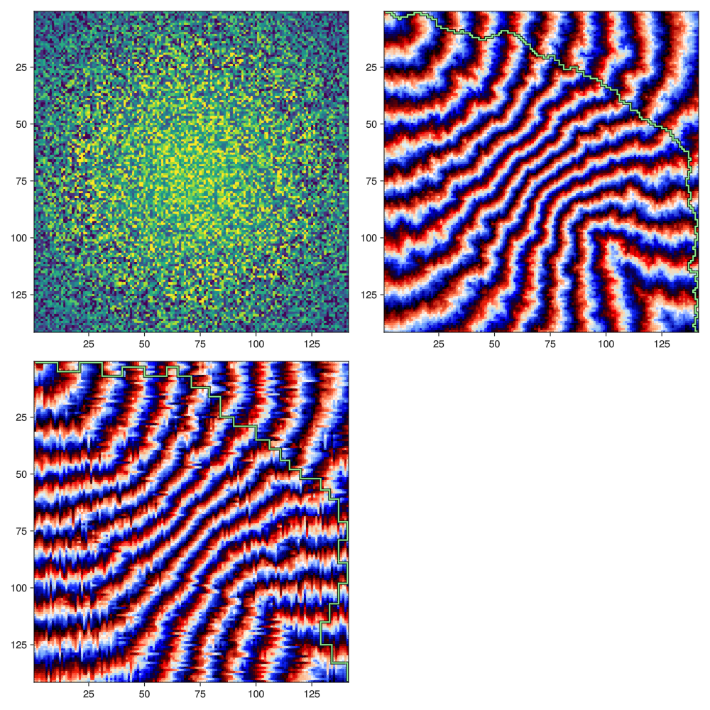

# Day 17: Clumsy Crucible
Shortest path usually means Dijkstra's algorithm, or some variant thereof. I copied my `grid_dijkstra` function from last year.

``` {.julia #grid-dijkstra}
using DataStructures

function grid_dijkstra(
  ::Type{T}, size::NTuple{Dim,Int},
  start::Vector{CartesianIndex{Dim}}, istarget::Function,
  neighbours::Function, dist_func::Function) where {T,Dim}

  visited = fill(false, size)
  distance = fill(typemax(T), size)
  for s in start
    distance[s] = zero(T)
  end
  queue = PriorityQueue{CartesianIndex{Dim},T}()
  prev = Array{CartesianIndex{Dim},Dim}(undef, size)
  for s in start
    enqueue!(queue, s, zero(T))
  end
  current = nothing
  while !isempty(queue)
    current = dequeue!(queue)
    istarget(current) && break
    visited[current] && continue
    for loc in neighbours(current)
      visited[loc] && continue
      d = distance[current] + dist_func(current, loc)
      if d < distance[loc]
        distance[loc] = d
        prev[loc] = current
        enqueue!(queue, loc, d)
      end
    end
    visited[current] = true
  end
  (distance=distance, route=prev, target=current)
end

function trace_back(prev, start, target)
  route = [target]
  current = target
  while current != start
    current = prev[current]
    pushfirst!(route, current)
  end
  route
end
```

## Part 1
The complication of only stepping three steps in the same direction increases the state-space. It is not enough to remember the amount of steps we've traversed in a straight line, for that may occur in four directions. We may take the three step history as an extra dimension on our grid of size 12 (that is: four directions times max three consecutive steps). In fact, I'll go for a size of `(n, m, 4, 3)`.

The implementation of Part 2 is a bit more generic. For Part 1, we have a jump size of 1 and a maximum straight path of 3.

## Part 2
We can take the cost function to the sum of cells between start and end, not including start.

``` {.julia #day17}
s = size(cost)

function cost_fn(a, b)
  if a[1] == b[1]
    p, q = minmax(a[2], b[2])
    sum(cost[a[1], p:q]) - cost[a[1], a[2]]
  else
    p, q = minmax(a[1], b[1])
    sum(cost[p:q, a[2]]) - cost[a[1], a[2]]
  end
end
```

When creating neighbours, choices are: turn with a n-cell jump, or go straight one step.

``` {.julia #day17}
function neighbours(a)
  dx = [(0, 1), (1, 0), (0, -1), (-1, 0)]
  at = Tuple(a)

  function step(di)
    if di == 0
      CartesianIndex((at[1:2] .+ dx[a[3]])..., a[3], a[4] + 1)
    else
      i = mod1(a[3] + di, 4)
      CartesianIndex((at[1:2] .+ (dx[i] .* jump))..., i, jump)
    end
  end

  inbounds(c::CartesianIndex{4}) = c[1] > 0 && c[1] <= s[1] && c[2] > 0 && c[2] <= s[2] && c[4] <= max_straight
  filter(inbounds, [step(di) for di in -1:1])
end
```

The problem doesn't mention anything about this, but we can start in two different directions.

``` {.julia #day17}
target(a) = (a[1], a[2]) == s

grid_dijkstra(
  Int, (s..., 4, max_straight),
  [CartesianIndex(1, 1, 1, 1),
    CartesianIndex(1, 1, 2, 1)],
  target, neighbours, cost_fn)
```

## Main

``` {.julia file=src/Day17.jl}
module Day17

<<grid-dijkstra>>

function find_path(cost, jump, max_straight)
  <<day17>>
end

function main(io::IO)
  cost = readlines(io) .|> collect .|> (x -> x .- '0') |> stack
  dist1, _, tgt1 = find_path(cost, 1, 3)
  println("Part 1: ", dist1[tgt1])
  dist2, _, tgt2 = find_path(cost, 4, 10)
  println("Part 2: ", dist2[tgt2])
end

end
```

``` title="output day 17"

```

## Visualized

``` {.julia .task}
#| creates: docs/fig/day17.png
#| requires: src/Day17.jl input/day17.txt
#| collect: figures
using GLMakie
using AOC2023.Day17: find_path, trace_back

function plot_path(p, block=nothing)
	route = trace_back(p.route, CartesianIndex(1,1,1,1), p.target) .|> (i -> [i[1], i[2]]) |> stack

	if isnothing(block)
		fig = Figure(size=(1000,1000))
		blockm = fig[1,1]
	else
		blockm = block
	end
	ax = Axis(blockm; yreversed=true)
	heatmap!(ax, minimum(p.distance; dims=(3,4))[:,:,1,1]; colormap=:flag)
	lines!(ax, route; color=:black, linewidth=4)
	lines!(ax, route; color=:lightgreen, linewidth=2)
	
	if isnothing(block)
		return fig
	end
end

cost = open(readlines, "input/day17.txt", "r") .|> collect .|> (x -> x .- '0') |> stack;
p1 = find_path(cost, 1, 3);
p2 = find_path(cost, 4, 10);

fig = Figure(size=(1000,1000))
ax = Axis(fig[1,1]; yreversed=true)
heatmap!(ax, cost)
plot_path(p2, fig[2,1])
plot_path(p1, fig[1,2])
save("docs/fig/day17.png", fig)
```


