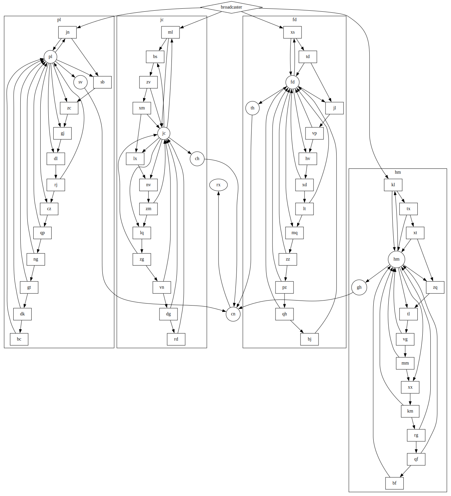

# Day 20: Pulse Propagation



``` {.julia file=src/Day20.jl}
module Day20

using ..Parsing: sequence, token, fmap, sep_by_p, many_p

abstract type Module end
mutable struct FlipFlop <: Module
  name::Symbol
  destinations::Vector{Symbol}
  sources::Vector{Symbol}
  state::Bool
end
FlipFlop(n::Symbol, d::Vector{Symbol}) = FlipFlop(n, d, [], false)
mutable struct Conjunction <: Module
  name::Symbol
  destinations::Vector{Symbol}
  sources::Vector{Symbol}
  memory::IdDict{Symbol,Bool}
end
Conjunction(n::Symbol, d::Vector{Symbol}) = Conjunction(n, d, [], IdDict())
struct Broadcaster <: Module
  name::Symbol
  destinations::Vector{Symbol}
end

input_p = let
  symbol = token(r"[a-z]+") >> fmap(m -> Symbol(m.match))
  destinations = token("->") >>> sep_by_p(symbol, token(",")) >> fmap(Vector{Symbol})
  flip_flop = sequence(token("%") >>> symbol, destinations) >> fmap(splat(FlipFlop))
  conjunction = sequence(token("&") >>> symbol, destinations) >> fmap(splat(Conjunction))
  broadcaster = sequence(token("broadcaster") >> fmap(Symbol), destinations) >> fmap(splat(Broadcaster))
  flip_flop | conjunction | broadcaster
end

function handshake(m::FlipFlop, src::Symbol)
  push!(m.sources, src)
end

function handshake(m::Conjunction, src::Symbol)
  push!(m.sources, src)
  m.memory[src] = false
end

function reset(m::FlipFlop)
  m.state = false
end

function reset(m::Conjunction)
  for k in keys(m.memory)
    m.memory[k] = false
  end
end

function reset(::Broadcaster)
end

function machine(inp, callback)
  queue = []

  function send(d::Symbol, s::Symbol, b::Bool)
    callback(d, s, b)
    d in keys(inp) || return
    push!(queue, (inp[d], s, b))
  end

  function handle(m::FlipFlop, ::Symbol, b::Bool)
    b && return
    m.state = !m.state
    for d in m.destinations
      send(d, m.name, m.state)
    end
  end

  function handle(m::Conjunction, src::Symbol, b::Bool)
    m.memory[src] = b
    a = !all(values(m.memory))
    for d in m.destinations
      send(d, m.name, a)
    end
  end

  function handle(m::Broadcaster, ::Symbol, b::Bool)
    for d in m.destinations
      send(d, m.name, b)
    end
  end

  function run()
    while !isempty(queue)
      msg = popfirst!(queue)
      handle(msg...)
    end
  end

  return (send, run)
end

function part1(inp, n=1000)
  highs = 0
  lows = 0

  function callback(::Symbol, ::Symbol, b)
    b ? (highs += 1) : (lows += 1)
  end

  send, run = machine(inp, callback)

  foreach(reset, values(inp))
  for _ in 1:n
    send(:broadcaster, :button, false)
    run()
  end

  highs * lows
end

function part2(inp)
  count = 0
  periods = IdDict(
    :th => 0,
    :sv => 0,
    :gh => 0,
    :ch => 0,
  )

  function callback(d::Symbol, ::Symbol, b::Bool)
    if !b && d in keys(periods) && periods[d] == 0
      periods[d] = count
    end
  end

  send, run = machine(inp, callback)
  foreach(reset, values(inp))
  while any(values(periods) .== 0)
    count += 1
    send(:broadcaster, :button, false)
    run()
  end

  periods |> values |> splat(lcm)
end

function read_input(io::IO)
  inp = IdDict((m.name => m) for m in readlines(io) .|> (first ∘ input_p))
  for (n, m) in inp
    for d in m.destinations
      d in keys(inp) || continue
      handshake(inp[d], n)
    end
  end
  inp
end

function main(io::IO)
  inp = read_input(io)
  println("Part 1: ", part1(inp))
  println("Part 2: ", part2(inp))
end

end
```

``` title="output day 20"

```

??? "Creating the graph"

    ``` {.julia .task}
    #| requires: src/Day20.jl input/day20.txt
    #| creates: docs/fig/day20.svg
    #| collect: figures

    using GraphvizDotLang: digraph, subgraph, node, edge, save
    using AOC2023.Day20: read_input, FlipFlop, Conjunction, Broadcaster

    inp = open(read_input, "input/day20.txt", "r")

    g = let
	    g = digraph()

	    subs = IdDict(
		    :broadcaster => subgraph(g, "broadcaster"),
		    :hm => subgraph(g, "cluster_hm"; label="hm", rank="min"),
		    :jc => subgraph(g, "cluster_jc"; label="jc", rank="min"),
		    :pl => subgraph(g, "cluster_pl"; label="pl", rank="min"),
		    :fd => subgraph(g, "cluster_fd"; label="fd", rank="min"),
		    :cn => subgraph(g, "cn"; rank="sink"))
	    
	    for (k, v) in inp
		    shape(::FlipFlop) = "box"
		    shape(::Conjunction) = "circle"
		    shape(::Broadcaster) = "diamond"

		    if v isa Broadcaster
			    g |> node("$$k";shape=shape(v))
			    for l in v.destinations
				    g |> edge("$$k", "$$l")
			    end
			    continue
		    end
			    
		    grp = (v.sources ∪ v.destinations ∪ [k]) ∩ keys(subs)
		    sub = isempty(grp) ? g : subs[first(grp)]
		    
		    sub |> node("$$k";shape=shape(v))
		    for l in v.destinations
			    sub |> edge("$$k", "$$l")
		    end
	    end
	    g
    end

    save(g, "docs/fig/day20.svg")
    ```

