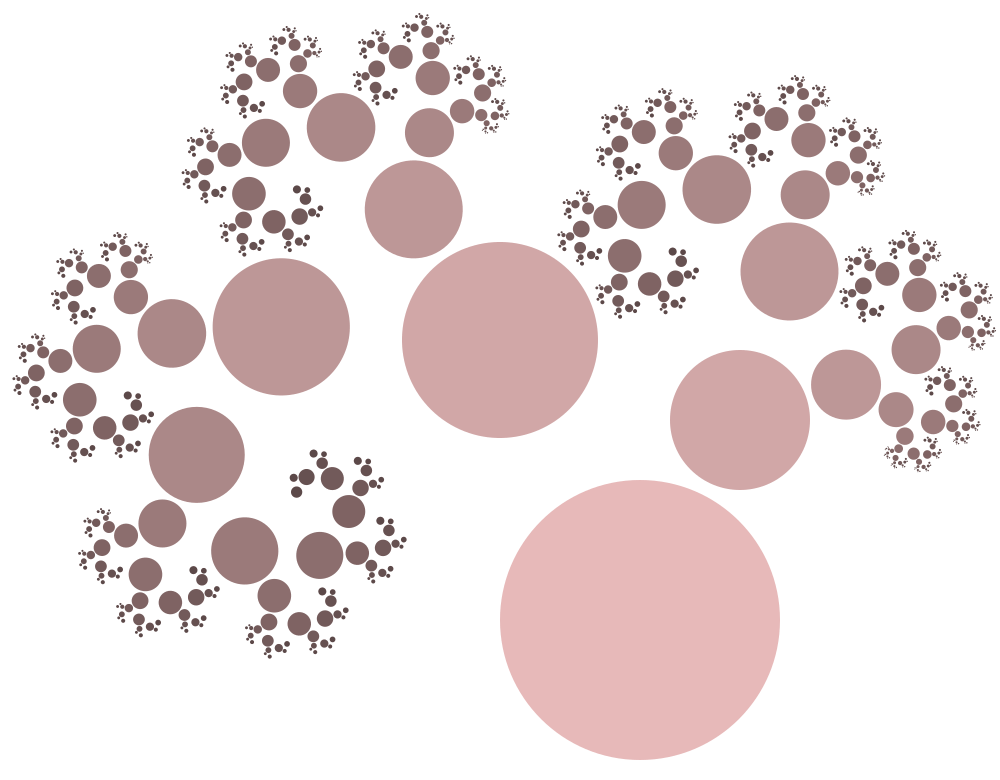

# Programmable XML from Scheme
Often when I need to create a diagram or illustration I find myself frustrated with the lack of programmability of Inkscape or the unfathomable syntax of Tikz. What do I need to do to program SVG directly? Thankfully, there is Scheme. If you don't know what Scheme is, welcome to a [world filled with magic and wonders](https://ocw.mit.edu/courses/6-001-structure-and-interpretation-of-computer-programs-spring-2005/video_galleries/video-lectures/)!

## The plan
The following Scheme script translates S-expressions to XML. This lets you use the full (R6RS) Scheme language to generate any XML document. This script is fully R6RS compatible, but it does use some libraries that are specific to Guile, namely `(ice-9 format)` and `(ice-9 match)`.

```bash
guile xml-gen.scm <<EOF | xmlindent -i 2
'((html)
  (h1) "Hello, World!" (/h1)
  (p) "This is translated into HTML." (/p)
  (/html))
EOF
```

Gives output:

```html
<html>
  <h1>
    Hello, World!
  </h1>
  <p>
    This is translated into HTML.
  </p>
</html>
```

The input can be any number of Scheme expressions; they will be evaluated as if contained in a `(begin ...)` block.

I use this to create programmable SVG documents. If you want to do anything similar for a serious project, consider using something less hacky. The upshot of this implementation is that it is extremely trivial in Scheme. The full implementation can be found in the [Source](#source) section.

## Example
Let us build a Pythagorean tree as an example. We build a binary tree out of SGV transformations.

``` {.bash .task}
#| creates: docs/fig/pythagoras.png
#| description: Pythagorean tree
#| requires: examples/pythagoras.scm examples/pythagoras.css
#| collect: figures
guile xml-gen.scm < examples/pythagoras.scm \
    | rsvg-convert -z 2 > docs/fig/pythagoras.png
```



??? "Strip CSS comments"

    ``` {.scheme #strip-css-comments}
    (define (strip-css-comments text)
      (let loop ((result '())
                 (text text))
        (if (zero? (string-length text))
          (apply string-append (reverse result))
          (let* ((a (string-contains text "/*"))
                 (b (if a (string-contains text "*/" (+ a 2)) #f))
                 (chunk (if (and a b) (substring text 0 a) text))
                 (remain (if (and a b) (substring text (+ b 2) (string-length text)) "")))
            (loop (cons chunk result) remain)))))
    ```

``` {.scheme file=examples/pythagoras.scm}
(import (rnrs (6))
        (srfi srfi-13))

;; not shown here, boring
<<strip-css-comments>>

(define style-sheet
  (strip-css-comments
    (call-with-input-file "examples/pythagoras.css" get-string-all)))

(define transform-1 "scale(0.5) translate(100 200) rotate(-45)")
(define transform-2 "scale(0.7) translate(-100 200) rotate(60)")

(define (build-tree depth t1 t2 fig)
  (let loop ((d depth)
             (content '()))
    (if (zero? d)
      content
      (loop 
        (- d 1)
        `((g class: "leaf" data-depth: d) ,@fig 
              (g transform: ,t1) ,@content (/g)
              (g transform: ,t2) ,@content (/g)
          (/g))))))

`((?xml version: "1.0" standalone: "no" ?)
  (svg viewBox: "0 0 500 390"
       xmlns: "http://www.w3.org/2000/svg"
       xmlns:xlink: "http://www.w3.org/1999/xlink")
    (style) ,style-sheet (/style)
    (g transform: "translate(320 310) scale(1 -1)")
    ,@(build-tree 10 transform-1 transform-2 '((circle cx: 0 cy: 0 r: 70 /)))
    (/g)
  (/svg))
```

We use pink as a base color, then darken every branch in the tree by 80%.

``` {.css file=examples/pythagoras.css}
g.leaf circle {
   fill: #ffcccc;
}

g.leaf {
   filter: brightness(80%);
}
```

## Source
I use the `match` macro to match the S-expressions to well known XML patterns. Specifically, I match for

- `(tag attr1: "value" attr2: "value") ... (/tag)`
- `(tag attr1: "value" /)`
- `(/tag)`

and translate those to their XML equivalents (incidentally, the more obscure `(?xml ... ?)` header also parses correctly).

``` {.scheme file=xml-gen.scm}
(import (rnrs)
        (rnrs eval)
        (ice-9 match)
        (ice-9 format))

<<main>>
```

We read all input from standard input. The `read-all` function returns the corresponding S-expression.

``` {.scheme #main}
(define (read-all)
  (do ((x (read) (read))
       (r '() (cons x r)))
      ((eof-object? x) (reverse r))))
```

Keywords are symbols that end with a colon.

``` {.scheme #main}
(define (string-ends-with? c s)
  (eq? c (string-ref s (- (string-length s) 1))))

(define (keyword? obj)
  (and (symbol? obj) (string-ends-with? #\: (symbol->string obj))))

(define (keyword->string obj)
  (let ((str (symbol->string obj)))
    (substring str 0 (- (string-length str) 1))))
```

The `kwargs->attrs` function translates a list of arguments to XML format. For example:

``` {.scheme}
(kwargs->attrs '(a: 1 b: 2 c: "hello"))
=> ("a=\"1\" b=\"2\" c=\"hello\")
```

``` {.scheme #main}
(define (kwargs->attrs lst)
  (let loop ((lst lst)
             (r   '()))
    (match lst
      (((? keyword? kw) arg . rest)
       (loop rest
             (cons (format #f "~a=\"~a\"" (keyword->string kw) arg) r)))
      (('/) (reverse (cons "/" r)))
      ((a . rest)
       (loop rest
             (cons (format #f "~a" a) r)))
      (()  (reverse r)))))
```

Anything that is not a list is kept as is.

``` {.scheme #main}
(define (xmlize expr)
  (match expr
    ((tag)           (string-append "<" (symbol->string tag) ">"))
    ((tag . kwargs)  (string-append "<" (symbol->string tag) " " (string-join (kwargs->attrs kwargs) " ") ">"))
    (a               a)))
```

Any `(import ...)` statements at the start are extracted and used to create the [environment](environment) in which the rest of the document is evaluated.

``` {.scheme #main}
(define (run code)
  (match code
    ((('import . <imports> ) . <program>)
     (eval (cons 'begin <program>)
           (apply environment '(rnrs) <imports>)))
    (<program>
     (eval (cons 'begin <program>)
           (environment '(rnrs))))))

(let* ((src  (read-all))
       (expr (run src)))
  (display (string-join (map xmlize expr) "\n")) (newline))
```

## Resources

- [Kent R Dubvig - The Scheme Programming Language](https://scheme.com/tspl4/)

